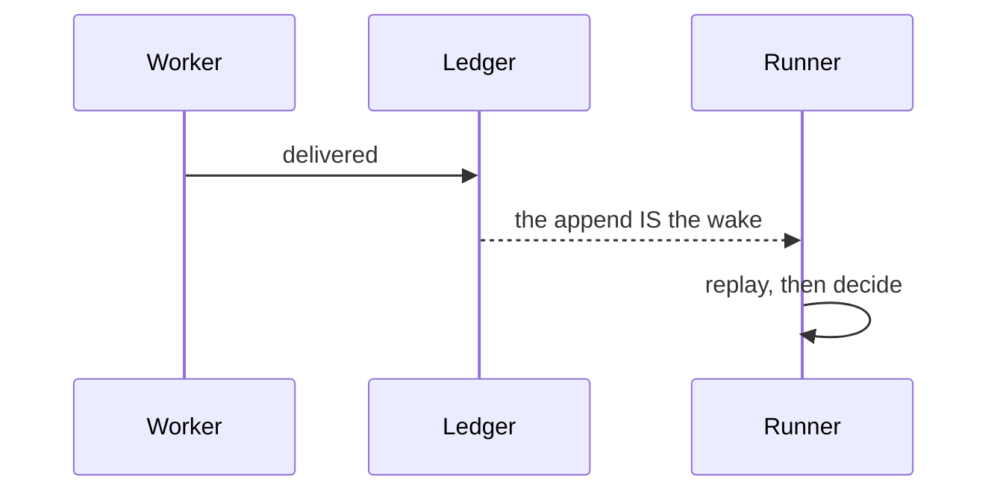

Show the current topic visually. Skip the preamble, keep prose short, and pick
the **smallest** view that makes the point.

**Source.** The forms below are adapted from humanlayer's `show-me` skill,
MIT-licensed:
<https://github.com/humanlayer/skills/blob/main/plugins/show-me/skills/show-me/SKILL.md>.
The examples and the rules after them are this repository's.

## The forms

Logic or an algorithm — pseudocode:

```text
on(delivered)
  if the leg is not the one this seat is running
    keep the seat
  free the seat
  keep the team's slot
```

Runtime control flow — a call tree:

```text
tick
  planPulls
  planDispatches
    teamOccupancy        # one replay, memoised per items map
    nextStep
  planEscalation
```

File responsibility or a refactor — a shallow file tree:

```text
plugins/tmux-teams/skills/tmux-teams/scripts/
├── domain-bus.mjs        # the mechanism, no domain knowledge
├── domain-team.mjs       # slot accounting
└── domain-projection.mjs # the durable log, replayed
```

A tree with the wrong root is the rule below breaking itself: the first draft of
this file rooted these three at `scripts/`, where they do not live, and a review
lane caught it.

Interaction over time — Mermaid:



What CHANGES, when the surrounding shape already exists — a diff, in whatever
shape the topic is:

```diff
 on(completed)
-  release every slot
+  hand the token to control
+  keep it there until it is audited
```

The whole block when most of it is new, or when the reader needs a copyable
target shape — plain code.

A layout, a state comparison, or something too dense for Mermaid — one focused
HTML file, then open it:

```
Bash(open path/to/show-me-{description}.html)
```

## Rules this repository adds

- **A number is not a picture, and a picture is not a measurement.** A diagram
  proves a shape and cannot prove a quantity; a measurement proves a quantity
  and cannot prove a shape. If the answer turns on both, show both, and say
  which one each claim rests on. This repository has recorded four consecutive
  "done" reports where every number was right and nobody had opened the picture.
- **Draw what is, not what was planned.** Read the code or the file before
  drawing it. A diagram of the intended design, presented as the system, is the
  most expensive kind of wrong here — it is believed, and it is not checked.
- **Say what the picture leaves out.** Every view above is a reduction. Name the
  thing you dropped when dropping it could change the reader's decision.
- **Never invent a label.** Seats, events, teams and files have names in this
  system; use them exactly. A renamed box makes a reader search for something
  that does not exist.
- **One view, usually.** Several only when they answer different questions.
  Never all of them.
- **A page for a person gets published, not left in `/tmp`.** If the HTML is
  worth making, it is worth a source in the repository — see the pages list the
  repository keeps in its own `scripts/` directory (the roadmap renderer) and
  the reason it exists — a page with no source in git goes stale with nothing
  able to notice.
