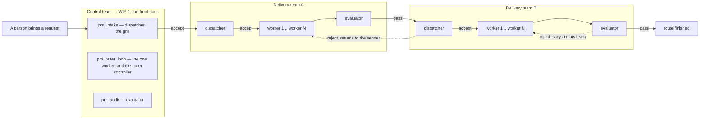
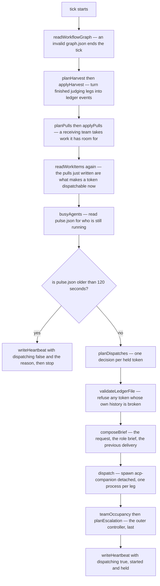
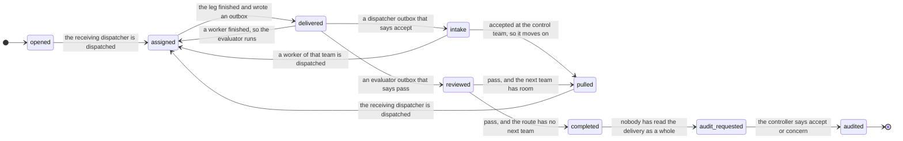
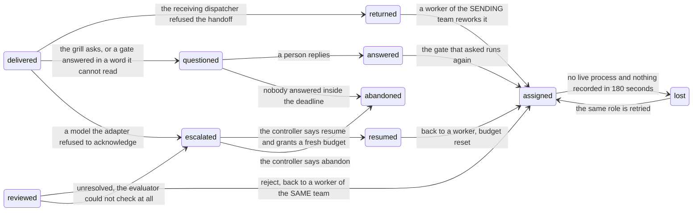
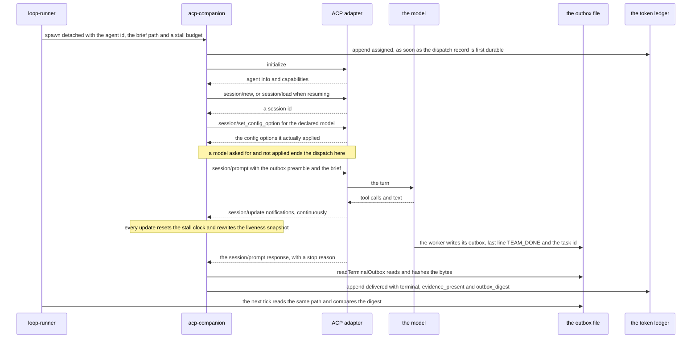
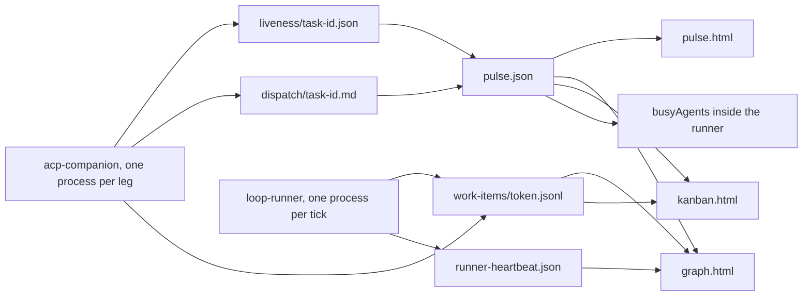

# How it works

You installed a plugin that runs a delivery loop. This file explains the
mechanics: who exists, what one tick does, how a work item moves, how a worker
is actually run, and where the published pages get their facts.

`references/loop-system-contract.md` is the rule book. This file is the picture,
and every diagram in it was drawn by reading the code rather than the prose.
Where a reference document and the code disagreed, the code won and the
disagreement is stated on the spot.

Five things worth knowing before the first diagram:

- **The ledger is the system.** `.tmux-teams/work-items/<token>.jsonl` is one
  append-only file per work item. Every question — who holds this, may it move,
  is it finished — is answered from that file. Nothing is ever rewritten.
- **The runner dispatches and records; it never judges.** Every verdict in a
  ledger was stated by the agent whose job it was to state it, in that agent's
  own outbox file.
- **Nothing is inferred from silence.** No answer is not a pass. No process is
  not a delivery.
- **Work is pulled, never pushed.** A team takes work it has room for.
- **A person is a first-class actor.** Two states wait on a human and the loop
  will not move them by itself.

---

## 1. The shape of the system

*Who exists, and where does work enter?*

A **team** is a resource: one dispatcher that owns the queue, one or more
workers, and the team's own evaluator. A **workflow** is a route through those
teams. Routing lives on the workflow, never inside the team, so a new workflow
is composed from teams that already exist. `workflow-graph.mjs` enforces both
halves: a route may not visit the same team twice, and it refuses any route
whose first team is not the control team.

`wip_limit` is not declarable. It equals the worker count, derived in
`validateWorkflowGraph`. A graph that states a different number is refused
rather than quietly overruled.

The control team is not a fifth delivery team. Its single worker *is* the outer
controller — the same seat `outer_controller_id` names — so its WIP is 1 and the
front door holds exactly one request at a time. `admit.mjs` is the only
sanctioned door in, and it obeys that limit: a request arriving while the
control team is full is refused, not queued.

> **Where the code differs from the docs.** `controller-as-team.md` §4 and the
> comment above `controlTeam` in `workflow-graph.mjs` both describe `pm_audit`
> as the seat that reads a finished route. It is not. `planEscalation` builds
> the audit brief with `roleBrief(repo, 'pm', ...)` and dispatches
> `graph.outer_controller_id` — that is `pm_outer_loop`. `pm_audit` is only ever
> dispatched as an ordinary team evaluator, which on the control team requires a
> token to be *returned* to it first. On the normal path `pm_audit` never runs.

---

## 2. One tick of the loop

*What does `loop-runner.mjs` do, and in what order?*

**The order is fixed and load-bearing.** Harvest runs first because pulling
before a review lands is what once made every evaluator decorative. Escalation
runs last because it decides on what the rest of the tick could not resolve.

Three bounds apply at the dispatch step: the team's own `wip_limit`, a
board-wide `MAX_IN_FLIGHT` of 4, and `MAX_LEGS` of 15 on any one token's whole
journey. Each is announced when it bites; none of them fails silently.

**The heartbeat is written on every tick, including the refusing ones.** A
heartbeat that only appeared on healthy ticks would say "alive and dispatching"
or say nothing, and nothing is the same silence a dead process leaves. On a
refusing tick `dispatching` is `false` and `reason` carries the runner's own
words.

The outer controller is dispatched on **anomalies, never on a timer**, and only
about one token at a time — its outbox ends in a single verdict line, so a leg
asked two questions could only answer one of them.

### What a dispatch carries, and one gap at this step

A seat declares two separate facts and the dispatch honours both. The **lane**
is the transport — `claude`, `codex` or `agy` — read from a team's `adapters`
block, from a `seats` entry that overrides it for one agent, or from
`outer_controller_adapter`, defaulting to `claude` so an existing graph is
unchanged. `validateWorkflowGraph` refuses any other name outright. The
**model** is what that lane is asked to run, requested and then verified (see
§4). The two are never substituted for one another.

Production dispatch also refuses to pass an ambient `ACP_CMD` down to the child.
An `ACP_CMD` left in a shell used to replace the adapter every seat ran on, with
nothing in the receipt able to say which one had answered. A test that needs
that seam names it deliberately through `TMUX_TEAMS_ACP_CMD`.

**The one gap here: a pull refusal never reaches the ledger.** `applyPulls`
returns the number of events it wrote and reports each refusal to stderr; the
runner calls it without reading the return value. A handoff the writer refused
is therefore visible only in the runner's log output, and the loop plans the
same pull again on the next tick.

---

## 3. The life of one work item

The state of a token *is* the name of the last event in its ledger. These are
the real event names from `EVENT_SPEC` in `ledger-validate.mjs`, and a name
outside that set is refused as `unknown_event`.

### 3a. The path when nothing goes wrong

*How does a token get from a request to a finished, audited route?*

`assigned` and `delivered` repeat once per leg — dispatcher, worker, evaluator —
so one team costs three of each. `assigned` and `delivered` are the only two
events written by `acp-companion.mjs`; every other event above is written by the
runner or the pull controller.

Two teams release work in different words, deliberately. A delivery team
releases on `reviewed` with verdict `pass`, because its evaluator checked an
artifact. The control team releases on `intake` with verdict `accept`, because
there is no artifact yet — admission is the claim that the request is workable.

### 3b. The path when something goes wrong

*What happens when a leg dies, a gate refuses, or only a person can decide?*

**Two escalation triggers are not edges and cannot be drawn.** The leg ceiling
is tested at the top of `nextStep`, before any branch on the last event, so a
token that has burned 15 legs escalates from *whatever* state it is in. A role
that has failed `MAX_ATTEMPTS` times escalates the same way, from any state that
would otherwise dispatch that role.

**And an escalation plan is not always an escalation event.** The runner writes
the `escalated` line only for the single token the controller's brief actually
asked about — its outbox ends in one verdict line, so a leg asked two questions
could answer only one. Other tokens whose plan says escalate are logged as
`STUCK` and their ledger does not move. Seeing `STUCK` with no matching ledger
line is correct behaviour, not a lost event.

**Which transitions need a person.**

| Transition | Who acts | Enforced? |
| --- | --- | --- |
| `questioned` to `answered` | a human | **Yes.** `answered` carries `actor_kind: human` and `validateLedger` refuses any other actor with `not_a_human_answer`. A model relaying a person's words signs `human:` and names itself in `relayed_by`. |
| the door into `opened` | a human, through `admit.mjs` | **No.** `admitWorkItem` documents `human:<name>` and passes the actor straight through; nothing checks the kind. Convention, not enforcement. |
| `questioned` to `abandoned` | the runner's clock | Automatic. A request nobody answers inside the deadline is withdrawn, a notice is written for the person under `.tmux-teams/notices/`, and the queue is freed. |

**Rejection is the only way work moves backwards.** A route never revisits a
team by routing. An evaluator's `reject` stays inside its own team; a
dispatcher's `reject` becomes `returned` and goes to the team that sent it. At
the front door alone a `reject` is *advice*, not a veto: it becomes `questioned`
carrying the objection, and the person may confirm anyway.

**Orderings the validator enforces.** `opened` may only be a token's first
event. A `delivered` needs a prior `assigned` by that same agent. A `reviewed`
needs something delivered. An `audited` needs an `audit_requested`. An
`answered` needs a `questioned`. `completed`, `audited` and `abandoned` are
terminal — and `completed` only half so, because the audit pair plus a question
and its answer are the sole legal continuations.

**One asymmetry worth knowing.** A dispatcher may *say* three words —
`accept`, `reject`, `question` — but the `intake` event accepts only the value
`accept`. A refusal becomes `returned`, `escalated` or `questioned` instead, so
an `intake` carrying anything else is a line this system cannot produce, and the
validator says so.

> **Where the code differs from the docs.** The intake grill is briefed to face
> six named categories, and its outbox is asked for a `CATEGORIES:` line. The
> runner reads that line only on the paths where the gate could *not* resolve
> something — the `question` branch and the front-door `reject` branch. On the
> `accept` path `readCategories` is never called, so an accepted request records
> nothing about which categories were faced. "Which category do requests die in"
> is answerable; "which categories were cleared" is not.

---

## 4. How a worker is run, and how its answer comes back

*What actually happens between the runner deciding to dispatch and an event
appearing in the ledger?*

### The outbox contract

`assigned` is appended before the ACP session exists — `flushPersistence` at
the top of `protocolRun` writes the dispatch record, and the first durable write
is what starts custody. That ordering is deliberate: a dispatch later refused
for its model has already recorded `assigned`, so the `delivered` that follows
it is a legal line rather than one the validator rejects as
`delivered_without_assigned`.

**An answer printed to the terminal is not an answer.** The one thing the
companion looks at when the turn ends is the file at
`.mailbox-out/<task-id>`. Nothing else counts, and a worker that explains its
result beautifully in chat has delivered nothing.

The file must be:

- **a single flat regular file.** `readTerminalOutbox` opens it with
  `O_NOFOLLOW` and `O_NONBLOCK`, so a symlink is refused at `open` and a FIFO
  returns instead of hanging the process forever. A directory, a symlink or a
  file over the size ceiling is `invalid_outbox`.
- **ended by exactly one terminal line**, matched literally against the task id:
  `TEAM_DONE <task-id>`, `TEAM_BLOCKED <task-id>` or `TEAM_FAILED <task-id>`.
  Anything else classifies as `invalid` and the companion exits 3.

Missing entirely, the companion raises `no_outbox` — *worker finished the turn
but wrote no outbox* — and the leg's `terminal` is `no-outbox`. A `delivered`
whose terminal is anything but `done` is never pulled forward: the pull
controller refuses it as a leg that produced no artifact.

Three more facts travel on the `delivered` event. `evidence_present` records
whether the outbox carried a real `EVIDENCE:` block — a bare "ok" or "pass"
does not count. `outbox_digest` records the sha256 of the exact bytes the
companion classified. A tick later the runner reads the same path; if the digest
disagrees, it does not trust the new bytes and does not loop on them. It parks
the token on a person and names what changed.

`work_observed` is the third, and it answers one narrow question: **did this
leg ever reach the model at all?** The companion is the only process present
when a leg dies at the transport — a spawn refused, an adapter that rejected
the declared model, a provider that rate-limited before a single prompt
round-tripped — and a leg that died that way is not a worker who tried and
failed. So `work_observed: false` says "nothing was asked of any model here",
and the runner excludes that leg from the worker's attempt budget. Only real
agent activity sets it true: a tool call, a message or thought chunk, a plan
update, a completed prompt turn. Notably **not** the operation receipt commit,
which happens during session setup before the prompt is even sent — it counted
until v0.15.0, which made every rate-limited leg look like a worker failure.

The leg still occupies the team while it runs and still counts against the
token's absolute leg ceiling. Only the ATTEMPT count changes. That distinction
is the whole of it: a token bouncing fifteen times is still bouncing, however
few of those legs reached a model.

### Why a session and not a one-shot command

The leg runs over an ACP **session** on stdio rather than a single shell
invocation. **This is not a chat window.** The companion sends exactly one
`session/prompt` per dispatch, and there is no human input path into it — that
stdin is the JSON-RPC transport to the adapter, nothing else. What the session
buys is not conversation; it is three things a one-shot command cannot give:

- **Progress is observable while the work happens.** `session/update`
  notifications arrive throughout the turn. Each one resets the stall clock and
  rewrites `.tmux-teams/liveness/<task-id>.json` with the tool calls currently
  running. A one-shot command gives you an exit code at the end and nothing
  before it, so a wedged worker and a working one look identical.
- **Stopping is a request, not a kill.** Cancellation is a protocol message that
  can be acknowledged, which is how the companion tells `cancelled` apart from
  `stalled` and from `agent-exit`. Only when the protocol fails to settle does
  it escalate to signals, and it records that it had to.
- **A session is resumable by id.** With `ACP_RESUME` and an adapter that
  advertises `loadSession`, `session/load` restores the history and the next
  dispatch continues that session instead of starting over. Continuity is
  resume-by-id, not an open channel.

**The human-in-the-loop path is the ledger, not the session.** When a gate needs
a person, the token is parked with `questioned` and released by `answered` —
events on disk, written by a human actor, that survive the process. Nothing is
asked of a person through a running ACP session, because a process that must
stay alive to hold a question loses the question when it dies.

### Identity — the model a seat was promised

Two different environment variables, and the pair is the point:

- `ACP_MODEL` is the **request**. It drives `session/set_config_option`, and if
  the adapter reports back a different value the dispatch fails with
  `config-option-not-applied`.
- `ACP_EXPECT_MODEL` is the **expectation**. It starts `identity_status` at
  `missing`, and `enforceIdentity` fails the dispatch as `identity-missing` or
  `identity-mismatch` unless the session answers with exactly that name.

`modelEnv` in `loop-runner.mjs` now sends both, so the declared model in
`graph.json` is asked for and then verified. It sends **neither** when the seat
declares the sentinel `inherit-account-default`, which is what keeps a fresh
install from failing every dispatch against a model nobody chose.

An identity refusal is not retried. `nextStep` escalates the token on the first
one, because a declared model the adapter will not acknowledge fails identically
every time and three more attempts only buy three more identical failures.

### A seat may name more than one model — the palette

A seat normally names one model. Since v0.15.0 it may instead declare an
ordered **palette**: up to eight whole seat specs, each with its own model,
lane, effort and display name. It is declared on the SEAT
(`teams[].seats.<agent_id>.palette`), never on a role — so declaring four
candidates costs no extra worker seats and does not move `wip_limit`.

Two things make it a fallback rather than a list. Each entry carries a
**`bucket`**, naming the rate-limit family it draws on (defaulting to its own
lane), and two CONSECUTIVE entries may not share one: neighbours in the same
bucket are not alternatives, since the limit that refused the first refuses the
second. And the walk is driven by `work_observed`, above — a leg that never
reached the model advances to the next candidate, while a leg that reached the
model and failed for real **retries the same one**. That is the distinction the
whole feature turns on: a model that answered and did badly is not a model that
is unavailable.

Once as many misses have accumulated on that seat as the palette has entries,
the runner escalates rather than starting the list again. That is a cheap
bound, not a proof about each candidate — a genuine failure in the middle
retries in place, so an entry can have reached the model while the counter
still fills. The escalation says only what it counted.

What a palette does **not** do: it is not a load balancer, it does not make a
leg free against the token's leg ceiling, and it cannot distinguish two
executables on one lane — `claude-qwen` and `claude-kimi` are the same
`adapter` here, so a palette cannot swap between them.

---

## 5. Evidence, and which page reports it

*Where does each published page get its facts?*

| Artifact | Written by | Answers |
| --- | --- | --- |
| `.tmux-teams/liveness/<task-id>.json` | the companion, continuously | is this one leg alive, and what tool is it running |
| `.tmux-teams/dispatch/<task-id>.md` | the companion | what this leg was, which model it asked for, what answered |
| `.tmux-teams/work-items/<token>.jsonl` | the runner, the pull controller, the companion, a person | the whole custody history of one work item |
| `.tmux-teams/runner-heartbeat.json` | the runner, every tick | is the **loop** alive, and is it dispatching |
| `.tmux-teams/pulse.json` | `pulse.mjs watch` | the aggregated process-liveness snapshot |

`pulse.json` is a contract about **processes**. The ledger is a contract about
**work**. They are deliberately separate files, and neither is derived from the
other.

- **pulse.html** — are the agents running. Rendered from `pulse.json` alone.
- **graph.html** — the board. Reads the graph, the ledgers and `teamOccupancy`
  for where work is, `pulse.json` for what is running, and the heartbeat for
  whether the loop itself is alive.
- **kanban.html** — where every token is right now, with the pull decision that
  applies to it. Reads the ledgers and `teamOccupancy`, and takes its clock from
  `pulse.json` so every page agrees on "as of".

Running `pulse.mjs once <repo>` republishes all three pages plus `pulse.json`.
The repo argument is required.

The loop closes here: the companion writes liveness, `pulse.mjs watch`
aggregates it into `pulse.json`, and `busyAgents` inside the runner reads that
file to decide who is free. That is why a stale snapshot stops dispatching —
see the first refusal below.

**Scene 1 of graph.html reports the live state. Every other scene explains how
work is meant to travel and updates nothing.** If a thing is evidence it belongs
on scene 1; if it is explanation it does not.
`references/loop-graph-page.md` is the rule for that page, including how to
check it — which is by measuring the DOM, never from a screenshot.

---

## What this system will refuse to do

These are the behaviours people most often read as bugs. Each one is a refusal
somebody chose.

**It will not dispatch on frozen evidence.** If `pulse.json` is more than 120
seconds old, `loop-runner.mjs` stops for the tick, prints the age and asks
whether `pulse.mjs watch` is running. A frozen snapshot is worse than none: it
can still claim agents are running, and it can no longer say when they stop.
Acting on it means either stalling forever or paying to re-run an agent that
never stopped.

**It will not invent a delivery.** When an `assigned` leg has no live process
and has recorded nothing for 180 seconds, `nextStep` in `loop-runner.mjs`
returns `lost` and `tick` records it — an event that says the leg is gone. It
does not write `delivered`, and it does not guess what the leg would have
produced. `lost` is also what frees that token from the team's WIP; without it
the token would sit there forever.

**It will not read a verdict a seat cannot state.** Each role answers in a
closed vocabulary, defined once in `role-briefs.mjs` beside the brief that asks
for it: `accept`/`reject`/`question` at intake, `pass`/`reject`/`unresolved` at
review, `resume`/`abandon` from the controller, `accept`/`concern` for an audit.
An outbox ending in a word outside its seat's list states nothing.
`applyHarvest` in `loop-runner.mjs` reports it and `tick` logs it as `WEDGED`,
naming the words it was looking for — because a wedged loop that printed
"nothing to move" looked exactly like an idle one. Silence is never a pass, and
`readVerdict` reads the **last** verdict line, so an agent that restates the
required format before deciding cannot have its own example counted as its
answer.

**It will not append an event that makes a history impossible, and it will not
build on one.** `ledger-writer.mjs` is the only sanctioned way a line enters a
ledger. It stamps an actor, checks the event against the field table, checks it
against the ledger it is joining, and refuses outright when that ledger was
already broken. `loop-runner.mjs` then validates a token's whole ledger before
dispatching onto it and names every problem it found. The cost is stated rather
than hidden: a token with an invalid ledger **stops moving** until a person
repairs it, and nothing is allowed to rewrite a line.

**It will not admit work through a full front door.** `admit.mjs` counts the
control team's occupancy through the same single function everything else uses
and refuses a new request while that team is at its WIP limit. The person is
told the queue is full and invited to send it again — not put in a queue that
hides the backlog. The limit lives in `admit.mjs`, not in the writer: a hand-run
`ledger-writer.mjs --event` carrying an `opened` still passes both validity
checks and bypasses the WIP count, because that writer judges one event against
one ledger and deliberately never reads the graph.
