# Phase Gate Runtime v1 — Governed Two-Level Delivery Loop

> **Status:** opt-in runtime contract and adversarial POC boundary.
>
> **Trust:** `advisory_same_uid`. This design proves local ledger/process
> consistency; it does not authenticate a human or service principal.

## 1. Expected outcome and business boundary

The runtime moves routine acceptance away from a PM bottleneck without removing
PM accountability:

- each Phase Team owns its inner plan → worker → review → rework loop;
- the receiving phase lead accepts or rejects the exact immutable exit
  artifact;
- the PM observes phase progress, handoff age, rework, and bottlenecks across
  the outer loop;
- only exception, deadlock, policy conflict, or indeterminate dispatch recovery
  returns to the PM;
- QA hands `qa_release_evidence` to the declared ProjectDelivery receiver,
  which is an endpoint rather than a fifth Phase Team.

The POC can prove enforcement, observability, and measurement readiness. It
cannot prove causal business value, realized ROI, evidence certification,
release approval, or business approval. Those require a prospective field
comparison using mature outcomes and complete cost/guardrail data.

## 2. Fixed delivery topology

```mermaid
flowchart LR
  PM["PM outer loop<br/>goal · phase · bottleneck · exception"]
  R["Requirement team<br/>business functions + validation + exceptions"]
  P["Prototype team<br/>clickable prototype"]
  D["Development team<br/>working software"]
  Q["QA team<br/>E2E + UAT report"]
  PD["ProjectDelivery receiver<br/>final routine acceptance"]

  RA["requirements_baseline"]
  PA["prototype_evaluation"]
  DA["development_delivery"]
  QA["qa_release_evidence"]

  PM -. "coordinate outer loop" .-> R
  PM -. "observe only" .-> P
  PM -. "observe only" .-> D
  PM -. "observe only" .-> Q
  R --> RA -->|"receiver accepts exact digest"| P
  P --> PA -->|"receiver accepts exact digest"| D
  D --> DA -->|"receiver accepts exact digest"| Q
  Q --> QA -->|"final receiver accepts"| PD
  R -. "exception only" .-> PM
  P -. "exception only" .-> PM
  D -. "exception only" .-> PM
  Q -. "exception only" .-> PM
```



Legal boundaries and artifacts are closed:

| Sender | Exit artifact | Receiver |
|---|---|---|
| Requirement | `requirements_baseline` | Prototype |
| Prototype | `prototype_evaluation` | Development |
| Development | `development_delivery` | QA |
| QA | `qa_release_evidence` | ProjectDelivery |

No phase skip, reverse edge, alternate artifact name, inferred phase, or
ProjectDelivery worker phase is valid.

## 3. Two loops and ownership

The inner loop belongs to the Phase Team:

```text
plan slice → reserve ACP worker → observe worker → team reviews result
     ↑                                               │
     └──────────── reject → immutable revision ──────┘
```

The outer loop belongs to the PM:

```text
Requirement → Prototype → Development → QA → ProjectDelivery
       monitor phase age, queue, handoff, rework, exception, final state
```

`TEAM_DONE`, a transport terminal, a legacy `pm_verdict`, KMS output, task
names, worker names, and timing proximity are observations only. None advances
a phase.

## 4. Governed-mode boundary

Governance is explicit through `<repo>/.tmux-teams/phase-gate.json`.

- marker absent and no Phase Gate environment: generic ACP behavior remains
  compatible;
- marker present: all ACP dispatches for that repo require an exact, unresolved
  reservation;
- malformed, unreadable, symlinked, unsupported, or mismatched marker: fail
  closed;
- Phase Gate environment in an ungoverned repo: fail closed;
- validation denial occurs before brief consumption, legacy dispatch
  footprint, ACP process/session, outbox, or KMS mutation.

The marker points to one separate single-slice operational store. It never
reuses or mutates the Stage 1 observational pilot store.

## 5. Reservation-first actuation

A reservation is durable before process creation and binds:

- project run, Delivery Slice, phase run, attempt, handoff, and exact boundary;
- receiver-owned acceptance event;
- artifact submission event and artifact digest;
- receiver actor claim from the frozen roster;
- dispatch UUID, task, agent, brief digest, and timeout;
- expected committed ledger head and `advisory_same_uid`.

The companion then records this order:

```mermaid
sequenceDiagram
  participant PT as "Sending Phase Team"
  participant RL as "Receiving phase lead"
  participant C as "Phase Gate Controller"
  participant W as "ACP companion / worker"
  participant P as "Pulse observer"
  participant PM as "PM exception owner"

  PT->>RL: "Propose immutable exit artifact + artifact event + digest"
  RL->>C: "Accept exact attempt/artifact as receiver"
  C->>C: "Replay ledger + compare expected head"
  C->>C: "Append dispatch reservation"
  C->>W: "Spawn with reservation + dispatch UUID"
  W->>C: "Append child registration (first mutation)"
  W->>C: "Append exact artifact consumption"
  W->>W: "Write legacy dispatch footprint"
  W->>C: "Append footprint observation"
  W->>W: "Initialize ACP and send prompt"
  W->>C: "Append prompt observation"
  W->>C: "Append terminal observation"
  C-->>P: "Atomically refresh observe-only runtime projection"
  alt "ambiguous crash or conflicting evidence"
    C-->>PM: "Indeterminate dispatch; blind retry blocked"
    PM->>C: "Append abandoned or terminal_observed resolution"
  end
```

For Requirement bootstrap there is no fabricated predecessor acceptance or
artifact consumption. For QA → ProjectDelivery there is final receiver
acceptance and no receiver ACP dispatch or consumption event.

## 6. Crash, contention, and retry semantics

- Store append uses a cross-process exclusive lock, committed head, canonical
  content-addressed event IDs, and a linked hash chain.
- Tail deletion, full event deletion, changed event body, sequence gap, fork,
  symlink, and foreign namespace entries fail closed.
- An identical command/idempotency body returns the original event; a changed
  body under the same identity is a conflict.
- A crash after an event file but before head replacement creates a detectable
  orphan. Explicit manual reconciliation may advance over exactly one valid
  orphan and never rewrites/deletes ledger history.
- A reservation or partially observed process whose outcome cannot be proven
  becomes `indeterminate`. The system does not auto-retry and does not claim
  exactly-once.
- An authorized PM may append `abandoned` only before consumption, permitting a
  deliberate new semantic dispatch. `terminal_observed` requires exact terminal
  evidence and preserves prior consumption.

## 7. Pulse projection and truth boundary

The controller atomically derives a path-free
`tmux-teams.delivery-runtime-projection` from a successful full replay:

- exact replay sequence/head;
- exactly four ordered phase runs;
- proposed, accepted, rejected, escalated, and consumed handoff attempts;
- exact receiver dispatch UUID only for normal consumed boundaries;
- deterministic bottleneck phase, kind, age, and owner role;
- `mode: observe_only`, actuation disabled, and
  `trust_level: advisory_same_uid`.

For the first three boundaries, acceptance alone is not completion. Completion
requires:

```text
accepted_digest == artifact_digest == consumed_digest
AND receiver_dispatch_id is the exact governed dispatch UUID
```

QA → ProjectDelivery completes on final receiver acceptance and must not claim
consumption. Pulse never accepts, rejects, consumes, dispatches, gates, or
resolves work.

## 8. Business-value and ROI measurement

The runtime makes these operational measures observable per phase and boundary:

- phase work age and completed phase count;
- receiver review/queue age;
- rejection and semantic revision count;
- exception and indeterminate-reconcile age;
- normal receiver-owned acceptance count;
- PM routine-routing touches versus PM exception touches;
- end-to-end time to final ProjectDelivery acceptance.

The deterministic POC reports these as `scenario_signal` and
`measurement_ready`. A realized ROI claim still requires:

```text
incremental benefit
  = mature usable-outcome value difference
  + loaded coordination/rework cost reduction
  - implementation and governance cost
```

with a pre-registered comparison, complete cost categories, mature outcomes,
security/performance/integration/UAT guardrails, and external business
decision. A favorable local run must remain `ROI_NOT_ESTABLISHED`.
