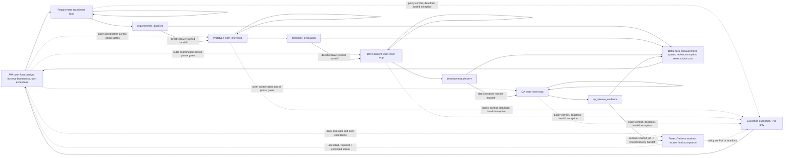
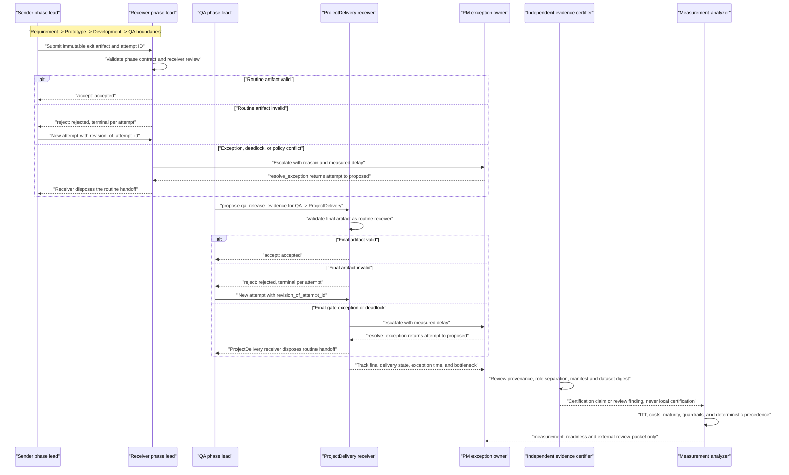

# Two-Level Delivery Loop — Stage 0 Measurement-Feasibility Contract

> **Status:** normative reference for the opt-in offline PoC. The JavaScript
> validator/analyzer is the executable source of truth when a detail conflicts.
> Plain English is intentional: the labels may be read by Thai-speaking operators
> without treating this document as an architecture proposal.

## 1. Claim boundary / ขอบเขตการอ้างผล

**Expected outcome.** Stage 0 proves that a two-level delivery loop can record,
validate, and analyze the required lifecycle, costs, outcomes, guardrails, and
evidence deterministically. Its business value is reduced uncertainty before a
field trial: it exposes whether the proposed experiment is *measurable*, not
whether it is beneficial.

Stage 0 MUST NOT claim causal value, realized ROI, a certified result, or a
business/release decision. Favorable synthetic or local observations are only a
`scenario_signal`. A prospective, independently governed **Stage 1 field pilot**
is required to test whether receiver-owned handoffs causally reduce cost or time
while preserving or improving mature value and guardrails.

The POC is opt-in and offline. It MUST NOT route workers, invoke tmux/ACP/KMS/
Pulse, call a network, mutate a mailbox, read unnamed files, certify evidence,
or actuate a business decision. The core is pure; the CLI reads its named JSON
input and writes structured JSON to stdout (errors to stderr).

## 2. Operating model and mandatory phase exits

`ProjectDeliveryLoop` is the PM-owned outer loop. A `PhaseTeam` owns one inner
loop and produces one receiver-checkable exit artifact. A `HandoffAttempt` is
one immutable proposal to the next phase or to the final `ProjectDelivery`
receiver. A `DeliverySlice` is the stable unit
assigned to an experiment arm at assignment time. An `EvidenceCertificationClaim`
is only a structured claim; same-UID local input cannot authenticate it.

| Sender phase | Exact phase-exit artifact `type` | Required phase-specific field | Exact receiver boundary |
|---|---|---|---|
| `Requirement` | `requirements_baseline` | non-empty `business_functions`; array `validation_exceptions` | `Prototype` |
| `Prototype` | `prototype_evaluation` | non-empty `clickable_prototype_ref` | `Development` |
| `Development` | `development_delivery` | non-empty `working_software_ref` | `QA` |
| `QA` | `qa_release_evidence` | non-empty `e2e_uat_report_ref` | `ProjectDelivery` |

Every artifact has non-empty `artifact_id` and `version`, a lowercase
`sha256:<64-hex>` `digest`, an array `predecessor_trace`, a non-empty array
`validation_evidence`, and non-empty `expectations.security`,
`expectations.performance`, `expectations.integration`, and `expectations.uat`.
`predecessor_trace` may be empty only for `Requirement`; later-phase artifacts
must retain at least one predecessor reference. The exact sender/receiver
boundaries are `Requirement` -> `Prototype`, `Prototype` -> `Development`,
`Development` -> `QA`, and `QA` -> `ProjectDelivery`. The final boundary is a
real receiver-owned routine handoff: the declared ProjectDelivery receiver
in `actors.phase_leads.ProjectDelivery` accepts or rejects
`qa_release_evidence`; the PM coordinates and tracks the outer loop but does
not replace routine receiver acceptance.

A phase rejects a malformed, stale, untraceable, or expectation-violating
artifact. Acceptance means only “deliverable is usable by the receiving boundary owner”;
it is not evidence certification or business approval. Artifact expectations
and the slice-level security, performance, integration, UAT, and escaped-defect
guardrails remain explicit rather than being folded into one success flag.



## 3. Authorities, attempts, and separate reviews

| Event | Exact actor authority | Exact transition |
|---|---|---|
| `propose` | declared `sender` | `draft` -> `proposed` |
| `accept` | declared `receiver_phase_lead` for the receiving phase or `ProjectDelivery` boundary | `proposed` -> `accepted` |
| `reject` | declared `receiver_phase_lead` for the receiving phase or `ProjectDelivery` boundary | `proposed` -> `rejected` |
| `cancel` | declared `sender` or `pm` | `proposed` -> `cancelled` |
| `abandon` | declared `pm` | `proposed` -> `abandoned` |
| `escalate` | declared `sender`, receiving `receiver_phase_lead`, or `pm` | `proposed` -> `escalated` |
| `resolve_exception` | declared `pm` | `escalated` -> `proposed`; the receiver then accepts or rejects, or an authorized actor cancels, abandons, or re-escalates |

The reducer's live lifecycle is therefore:

```text
draft --propose--> proposed --accept--> accepted
                           --reject--> rejected
                           --cancel--> cancelled
                           --abandon--> abandoned
                           --escalate--> escalated --resolve_exception--> proposed
```

`accepted`, `rejected`, `cancelled`, and `abandoned` are terminal. The reducer
may represent the live intermediate states `draft`, `proposed`, and `escalated`,
but every `handoff_attempts[]` record supplied to an experiment must end in a
terminal state and its non-empty `events` must replay from `draft` to that exact
recorded state. Event timestamps are strict RFC3339, non-decreasing within an
attempt, and all lie inside the inclusive observation interval
`[slice.assigned_at, analysis_as_of]`; violations report
`EVENT_BEFORE_ASSIGNMENT` or `EVENT_AFTER_ANALYSIS`.

Attempt IDs are globally unique across all slices. A correction after rejection
is a **new** attempt for the same slice and exact sender/receiver boundary, with
a new ID and `revision_of_attempt_id` pointing to a distinct, earlier, rejected
attempt. The parent remains immutable. Self-links, forward links, missing
parents, cross-slice links, cross-boundary links, or corrections that omit the
lineage pointer are invalid. The revision's `propose` event must also be
strictly later than the rejected parent's terminal event; array order or a new
attempt ID cannot substitute for this chronology. A chronology violation is
`REVISION_TIME_INVALID`.

Every attempt declares finite non-negative `sunk_cost_minutes`; an accepted
attempt must declare exactly zero. For rejected, cancelled, and abandoned
attempts, the slice's respective `rejected_work_minutes`,
`cancelled_work_minutes`, or `abandoned_work_minutes` must equal the sum of that
terminal state's attempt-level sunk cost. Invalid actors/transitions, duplicate
IDs, state/replay mismatch, or post-terminal mutation are validation failures.

Delivery acceptance is the receiving phase lead's or final ProjectDelivery
receiver's artifact decision. Evidence review is the independent certifier's provenance/separation/digest review. They
MUST be represented separately; delivery acceptance cannot upgrade evidence, and
an evidence review cannot retroactively accept a delivery.



## 4. Experiment and evidence contract

### Assignment, independence, and maturity

- The **intention-to-treat (ITT) unit** is every `DeliverySlice` at assignment,
  not a completed handoff or an accepted artifact. Each slice has a globally
  unique non-empty `slice_id`, one `arm` (`pm_routed` or `receiver_owned`), and
  an explicit non-null/non-empty value for every pre-registered stratum key.
- Arms are independent: `pm_routed` control and `receiver_owned` treatment.
  `assignment_method`, `strata`, and every slice's boolean `contamination` are
  explicit. Both arms must have assigned slices. A duplicate slice ID, missing
  arm, undeclared stratum value, or assignment outside the window is invalid;
  disclosed contamination remains in its assigned ITT arm and makes readiness
  `INCONCLUSIVE`.
- `preregistration.assignment_window` is the strict half-open interval
  `[start, end)`: equality at `start` is included and equality at `end` is
  excluded. `start`, `end`, `assigned_at`, event timestamps, `analysis_as_of`,
  and certification times use strict RFC3339 with a date, `T`, seconds, and `Z`
  or a numeric offset. Invalid calendar dates are rejected.
- A slice is mature only when `assigned_at + min_follow_up_days <= analysis_as_of`
  **and** `outcome.status` is `mature`. The closed outcome states are `mature`,
  `immature`, `censored`, `pending`, `cancelled`, and `abandoned`. Every other
  state remains in `intention_to_treat.non_mature_by_arm`; nothing is silently
  removed. A mature outcome requires finite non-negative
  `time_to_usable_outcome_minutes` and a finite `value_proxy` for conclusive
  comparison.

The pre-registration contains `manifest_id`, a falsifiable `hypothesis`,
non-empty `primary_kpis`, all five guardrails exactly once, the fixed estimand
`per_slice_mean_by_arm`, `assignment_window`, `assignment_method`, and non-empty
`strata`. It is accompanied by fixed `maturity`, `thresholds`, `cost_model`, and
`actors`. Thresholds are finite non-negative values for
`min_mature_per_arm`, `coordination_reduction_percent`,
`incremental_cost_reduction_percent`,
`time_to_usable_noninferiority_minutes`, and
`value_noninferiority_margin`.

`manifest.manifest_digest` is the canonical SHA-256 digest of the full
`schema_version`, `experiment_id`, `preregistration`, `maturity`, `thresholds`,
`cost_model`, and `actors`. Thus it binds the hypothesis, KPIs, guardrails,
estimand, assignment/strata/window, maturity, thresholds, blended cost model,
and actor registry. `dataset_digest` separately binds `experiment_id`,
`analysis_as_of`, and the complete `slices` array. Object keys are canonicalized
by true Unicode code-point order before hashing, not JavaScript's default
UTF-16 code-unit order; supplementary-plane keys therefore have a stable,
language-independent order.

### Provenance and trust limits

`provenance` is exactly one of `synthetic`, `observed_unverified`, or
`observed_certification_claimed`. A certification claim contains non-empty
`claim_id`, `scope`, `evidence_ref`, `method`, and `certifier_id`; strict
RFC3339 `claimed_at` and `expires_at`; and the exact `manifest_digest` and
`dataset_digest`. Its scope equals `experiment_id`, it cannot postdate
`analysis_as_of`, and it remains unexpired at that time. The certifier must be
declared and cannot overlap any sender, receiver phase lead, PM, experiment
owner, or metric producer.

Local data always produces `trust_level: advisory_same_uid`. It may validate a
claim's shape, role separation, time bounds, and digest binding, but it cannot
authenticate the person behind the ID, self-upgrade provenance, prove causal
impact, or certify a business outcome. Exact `evidence_eligibility` outputs are
`SYNTHETIC_ONLY`, `OBSERVED_UNVERIFIED`, and, for a fully matching local claim,
`ELIGIBLE_FOR_EXTERNAL_REVIEW`; none means certified evidence.

## 5. KPI hierarchy and complete cost accounting

The future field hypothesis is falsifiable: relative to `pm_routed`,
`receiver_owned` should reduce **total coordination time** and **incremental
loaded cost**, while mature time-to-usable-outcome and value improve or meet the
pre-registered non-inferiority margin, with no material guardrail regression.
Stage 0 only checks that this comparison can be measured.

| Level | Measures | Rule |
|---|---|---|
| Primary efficiency | total coordination minutes per-slice mean by arm; incremental loaded cost per-slice mean by arm | `per_slice_mean_by_arm` is the comparison estimand; arm totals are descriptive only; no causal or ROI conclusion in Stage 0 |
| Primary outcomes | mature time-to-usable-outcome; declared value proxy | only eligible mature outcomes enter outcome comparison; immature/censored remains visible |
| Diagnostic components | all explicit cost categories, including PM routing and queue/wait | `pm_routing_minutes_by_arm` is diagnostic, never the total-cost proxy |
| Guardrails | security; performance; integration; UAT; escaped defects; contamination | each slice guardrail is `PASS`, `BREACH`, or `UNKNOWN`; contamination is a separate explicit boolean |

Every slice's `costs` object contains every one of these keys:

```text
pm_routing_minutes              pm_exception_minutes
pm_evidence_minutes             receiver_review_minutes
governance_minutes              instrumentation_minutes
queue_wait_minutes              rework_minutes
rejected_work_minutes           abandoned_work_minutes
cancelled_work_minutes          sender_coordination_minutes
```

Each value is either a finite non-negative number or explicit `null` for
unknown. Omitting a key is invalid; `null` is not zero. The single blended
`cost_model` declares finite non-negative `loaded_cost_per_minute`, non-empty
`currency`, exact `unit: "minute"`, and non-empty `allocation_basis`.
`total_coordination_minutes` is the sum of all twelve categories, including
queue/wait and sunk work. `incremental_loaded_cost` is that total multiplied by
the blended rate.

If any required cost is `null`, the arm's total coordination minutes,
per-slice coordination mean, incremental loaded cost, and per-slice loaded-cost
mean remain `null`; `metrics.cost_complete` is false and readiness is
`INCONCLUSIVE`. Rejected, cancelled, and abandoned work is also tied back to
attempt-level `sunk_cost_minutes` as specified in section 3.

### Descriptive bottleneck output

`bottlenecks.basis` and every per-arm `basis` are exactly `descriptive_only`.
Each arm's `status` is `AVAILABLE` when every cost is known, otherwise
`INCONCLUSIVE` with `reason: "unknown_cost_category"` and null hotspot fields.
When available, `highest_coordination_phase` is the stratum phase with the
greatest sum of all cost-category minutes, and `largest_cost_category` is the
category with the greatest summed minutes. Equal totals use ascending Unicode
code-point order of the phase or category name, so input slice order cannot
change the result. These fields locate measurement hotspots only; they do not
alter `business_decision`, prove causality, or identify a root cause.

## 6. Deterministic result fields and precedence

The analyzer emits deterministic fields, not an automatic decision:

| Field | Meaning |
|---|---|
| `measurement_readiness` | `READY` only when both arms meet `min_mature_per_arm`, every assigned slice is mature, contamination is false, costs and mature outcomes are complete, and aggregate guardrails are not `UNKNOWN`; otherwise `INCONCLUSIVE` |
| `scenario_signal` | `INCONCLUSIVE` unless readiness is `READY`; then `FAVORABLE` only when both per-slice efficiency reductions meet thresholds and both mature outcomes meet their non-inferiority margins, otherwise `UNFAVORABLE` |
| `guardrail_status` | `BREACH` if any slice guardrail is `BREACH`, otherwise `UNKNOWN` if any is `UNKNOWN`, otherwise `CLEAR`; input slice values are exactly `PASS`, `BREACH`, or `UNKNOWN` |
| `evidence_eligibility` | exactly `SYNTHETIC_ONLY`, `OBSERVED_UNVERIFIED`, or `ELIGIBLE_FOR_EXTERNAL_REVIEW` for valid inputs |
| `safety_hold_recommended` | boolean, non-authoritative hold recommendation when `guardrail_status` is `BREACH` |
| `business_decision` | always `EXTERNAL_REQUIRED`; the analyzer MUST NOT emit `GO`, `ITERATE`, `NO_GO`, release approval, or ROI certification |
| `decision_packet.decision` | mirrors `business_decision` as `EXTERNAL_REQUIRED` with an explanatory reason for external review |

`READY` is a measurement-completeness result, not a delivery-success result.
The executable contract requires actor-authorized terminal histories, but does
not require an `accepted` attempt for readiness; rejected, cancelled, or
abandoned terminal histories remain measured. `READY` therefore never means
accepted delivery, release approval, causal effect, or ROI.

`metrics.estimand` is exactly `per_slice_mean_by_arm`. The comparison fields are
`total_coordination_minutes_per_slice_mean_by_arm`,
`incremental_loaded_cost_per_slice_mean_by_arm`,
`time_to_usable_outcome_mean_by_arm`, and `mature_value_mean_by_arm`.
`total_coordination_minutes_by_arm` and `incremental_loaded_cost_by_arm` are
descriptive totals. `total_coordination_reduction_percent` and
`incremental_loaded_cost_reduction_percent` are null when a valid comparison
cannot be formed, including a zero control mean. `pm_routing_minutes_by_arm`
remains diagnostic.

Apply precedence in this order:

1. Invalid contract input produces no report; validation errors identify stable
   `code`, `path`, and `message` values.
2. Readiness is `INCONCLUSIVE` for any non-mature assigned slice, insufficient
   mature sample, contamination, unknown cost, incomplete mature outcome, or
   aggregate `UNKNOWN` guardrail. `scenario_signal` is then `INCONCLUSIVE`.
3. A `BREACH` remains visible even when readiness and the metric comparison are
   otherwise complete. It sets `safety_hold_recommended: true`; it does not get
   erased by a favorable metric signal. A breach alone does not relabel
   measurement readiness as inconclusive.
4. `evidence_eligibility` is independent of metric signal and guardrail status;
   same-UID claims remain external-review-only.
5. `business_decision` and `decision_packet.decision` remain
   `EXTERNAL_REQUIRED` in every valid case. An adverse metric result or breach is
   reportable data, not an analyzer error or an automatic decision.

## 7. PoC operation, interpretation, and isolation

From repository root, run the named scenario through the opt-in CLI:

```bash
node plugins/tmux-teams/skills/tmux-teams/scripts/delivery-loop-poc.mjs analyze \
  tests/fixtures/delivery-loop-poc-favorable-synthetic.json

node plugins/tmux-teams/skills/tmux-teams/scripts/delivery-loop-poc.mjs analyze \
  tests/fixtures/delivery-loop-poc-adverse-synthetic.json

node plugins/tmux-teams/skills/tmux-teams/scripts/delivery-loop-poc.mjs analyze \
  tests/fixtures/delivery-loop-poc-observed-unverified.json

node plugins/tmux-teams/skills/tmux-teams/scripts/delivery-loop-poc.mjs analyze \
  tests/fixtures/delivery-loop-poc-certification-claimed.json
```

Interpret JSON by reading `measurement_readiness`, `scenario_signal`,
`guardrail_status`, `evidence_eligibility`, `safety_hold_recommended`, and
`business_decision` together. A favorable synthetic fixture may be
measurement-ready with a favorable `scenario_signal`, but is still synthetic
and `EXTERNAL_REQUIRED`. An adverse fixture must preserve its guardrail breach
and hold recommendation. An observed-but-unverified fixture may be a signal but
not eligible for certification. A local certification-claimed fixture may form
an external-review packet only; it never becomes certified locally.

The CLI accepts exactly `analyze <json-file>`. Success exits `0`, writes one
compact JSON report plus a newline to stdout, and writes nothing to stderr.
Usage errors exit `2` with a structured `USAGE` JSON diagnostic on stderr.
Unreadable or malformed JSON and contract-validation failures exit `1`, write
no report to stdout, and emit one structured JSON diagnostic on stderr. A
validation diagnostic uses `error: "DELIVERY_LOOP_VALIDATION_FAILED"` and an
array of `{code, path, message}` details.

These commands analyze one named fixture only. They do not dispatch or stop a
worker, alter project delivery state, write KMS/Pulse/mailbox data, contact a
certifier, access a real production dataset, or apply a recommendation. Existing
tmux-teams behavior is unchanged unless this CLI is invoked.

## 8. Stage 1 field-pilot gate / ทางไป field pilot

Start Stage 1 only after Stage 0 has validated fixtures/tests and an independent
review approves the preregistration, identity separation, data provenance, and
instrumentation plan. The pilot prospectively assigns eligible real slices to
the independent `pm_routed` and `receiver_owned` arms, freezes analysis windows
and thresholds before outcomes, retains all ITT slices, and uses an external
certifier/reviewer for evidence and any business decision.

Choose the first pilot boundary only when it is a single repeatable phase
handoff with: (1) enough similar future slices for both arms; (2) a stable,
receiver-checkable exit artifact; (3) measurable start, handoff, review, and
usable-outcome timestamps; (4) known loaded rates and complete cost ownership;
(5) no unresolved high-risk security, performance, integration, UAT, or
compliance dependency; (6) low contamination risk between arms; and (7) a
responsible business owner who accepts the pre-registered guardrails and
non-inferiority margin. If any criterion fails, instrument or narrow the
boundary first—do not use the field pilot to repair basic measurability.
